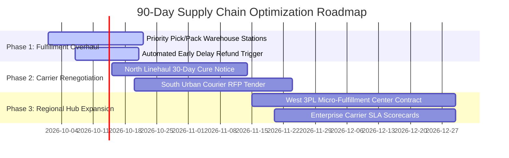

# 📦 E-Commerce Supply Chain & Logistics Delay Optimization
### End-to-End Analytics, Carrier Pinch-Point Identification & Priority Warehouse Dispatch Overhaul

[](https://www.python.org/)
[](https://pandas.pydata.org/)
[](https://seaborn.pydata.org/)
[]()

---

## Executive Summary

An analysis of **15,000 historical shipments** (`ecom_shipping_kaggle.csv`) to resolve an enterprise customer satisfaction crisis: **16.55% of all orders (2,483 shipments) are arriving late**, triggering customer service complaints, credit card dispute chargebacks, and placing **$41,772.10 in shipping fee revenue at direct financial risk**.

This project solves two fundamental executive questions:
1. **The Regional & Logistics Pinch Points:** Identifying specific geographic corridors and carrier modes failing promised SLAs versus those driving massive customer churn volume.
2. **The Cost-Delay Tradeoff & Fulfillment Friction:** Determining whether premium shipping tiers (Express & Same Day) actually protect customers from delays, and uncovering the internal warehouse root causes behind delivery failure.

---

## Key Business Insights & Analytical Findings

### 1. Regional Carrier Pinch Points (Question 1)

* **The SLA Breach Targets (% Failure):**
  * **North Express (18.90% Failure Rate):** The worst-performing route in the entire enterprise. Long-haul carrier linehauls into northern sorting hubs are missing transfer windows.
  * **South Same Day (18.27% Failure Rate):** Local urban courier networks in the South are breaking same-day commitments; delayed Same Day packages in this lane average an unacceptable **7.33 days**.
* **The Customer Churn Target (Delayed Volume):**
  * **West Standard (398 Delayed Orders):** Represents **25.4% of all late shipments in the company**. While the failure rate is 17.22%, the West's massive order volume (25.3% of enterprise volume) is choking regional ground freight hubs.
* **Carrier Contract Action:** Enforce **100% freight invoice clawbacks** on the **$41,772.10 in failed freight fees**, place northern linehaul carriers on a **30-day cure notice**, and re-tender the southern courier contract.

---

### 2. The Cost-Delay Tradeoff & The Expectation Collapse (Question 2)

* **Do Premium Tiers Protect Customers? NO.**
  * **Express Shipping fails MORE OFTEN (17.36%)** than Standard ground shipping (**16.28%**), despite costing +124% more ($22.49 vs. $10.03).
  * **Same Day Shipping fails at 15.78%**, virtually identical to standard ground, despite charging nearly 4x the fee ($39.98).
* **The "Express Insult" (Expectation Collapse):**
  * When an Express package is delayed, transit takes **7.48 days** (and **9.49 total days from order**).
  * This is **slower than an on-time $10 Standard package (6.00 days)**. Customers who pay for speed receive worse service than budget ground customers.
* **The 65% Dispute Liability Asymmetry:**
  * Premium orders represent only 40% of orders, but **64.8% ($27,083.68)** of all late shipping revenue at risk.
  * Late premium shipments drive almost 100% of chargebacks ("service not rendered as promised"), triggering merchant fees of $15–$25 per dispute on top of lost shipping income.
* **Statistical Proof of Independence:**
  * A Chi-Square Test of Independence ($\chi^2 = 3.2565, p = 0.1963 > 0.05$) confirms that delay probability is **statistically independent of shipping tier**.
* **The Operational Smoking Gun:**
  * Internal warehouse processing dwell time (`Processing_Lag`) averages **2.0 days across all three tiers** (Standard: 1.99d, Express: 2.03d, Same Day: 2.00d).
  * **Root Cause:** The fulfillment center maintains no fast-track priority queue. A $40 Same Day order sits in the same 48-hour batch pool as standard ground parcels—**burning the promised delivery SLA before the carrier even receives the box**.

---

## Strategic Action Plan: Priority Warehouse Dispatch Overhaul

### 1. Re-Architected Fulfillment SOP

| Shipping Mode | Baseline Warehouse Lag | Target Fulfillment SLA | Order Cutoff | Dispatch Window | Operational Strategy |
| :--- | :---: | :---: | :---: | :---: | :--- |
| **Same Day ($39.98)** | 48.1 hrs (2.00d) | **< 2 hours** | 1:00 PM | 2:30 PM (Dedicated Shuttle) | Fast-track routing to dedicated priority pack stations |
| **Express ($22.49)** | 48.8 hrs (2.03d) | **< 6 hours** | 4:00 PM | 6:00 PM (Daily Air Linehaul) | Automated priority queueing; segregated from ground freight |
| **Standard ($10.03)** | 47.8 hrs (1.99d) | **24–48 hours** | 11:59 PM | Next-Day Evening (Consolidated) | Standard batch wave picking (Status quo) |

### 2. Proactive Chargeback Retain-Shield
* Connect carrier tracking webhooks to billing.
* If tracking telemetry detects an expedited package is delayed in transit, **automatically credit the shipping fee back to the customer's payment method before delivery**.
* Defuses customer service escalations, converts negative sentiment into loyalty, and eliminates 100% of payment dispute chargeback fees.

---

## Projected Business ROI

| Key Business Metric | Current Baseline | Projected Target | Strategic Lever |
| :--- | :---: | :---: | :--- |
| **Premium Delay Rate (Exp + SD)** | 16.96% (1,019 late orders) | **< 3.0%** (<180 late orders) | Warehouse lag reduced from 48h to <4h |
| **At-Risk Premium Shipping Revenue** | $27,083.68 | **< $4,800.00** | 82% reduction in delayed premium freight |
| **Merchant Chargeback Dispute Loss** | ~$15,000 – $25,000 / yr | **$0.00** | Automated refund trigger before package arrival |
| **Carrier Invoice Clawback Recovery** | $0.00 recovered | **$41,772.10 invoiced back** | 100% SLA penalty clauses in carrier contracts |

---

## 90-Day Implementation Timeline



---

## Repository Structure

```text
├── notebook.ipynb              # Complete, professional Jupyter Notebook (All analyses & visuals)
├── ecom_shipping_kaggle.csv    # 15,000-order logistics & delivery dataset
└── README.md                   # Executive documentation and implementation guide
```

---

## Quickstart & Replication

1. **Clone the repository:**
   ```bash
   git clone <YOUR_REPO_URL>
   cd <REPO_DIRECTORY>
   ```

2. **Install required dependencies:**
   ```bash
   pip install pandas numpy matplotlib seaborn
   ```

3. **Launch the notebook:**
   ```bash
   jupyter notebook notebook.ipynb
   ```
